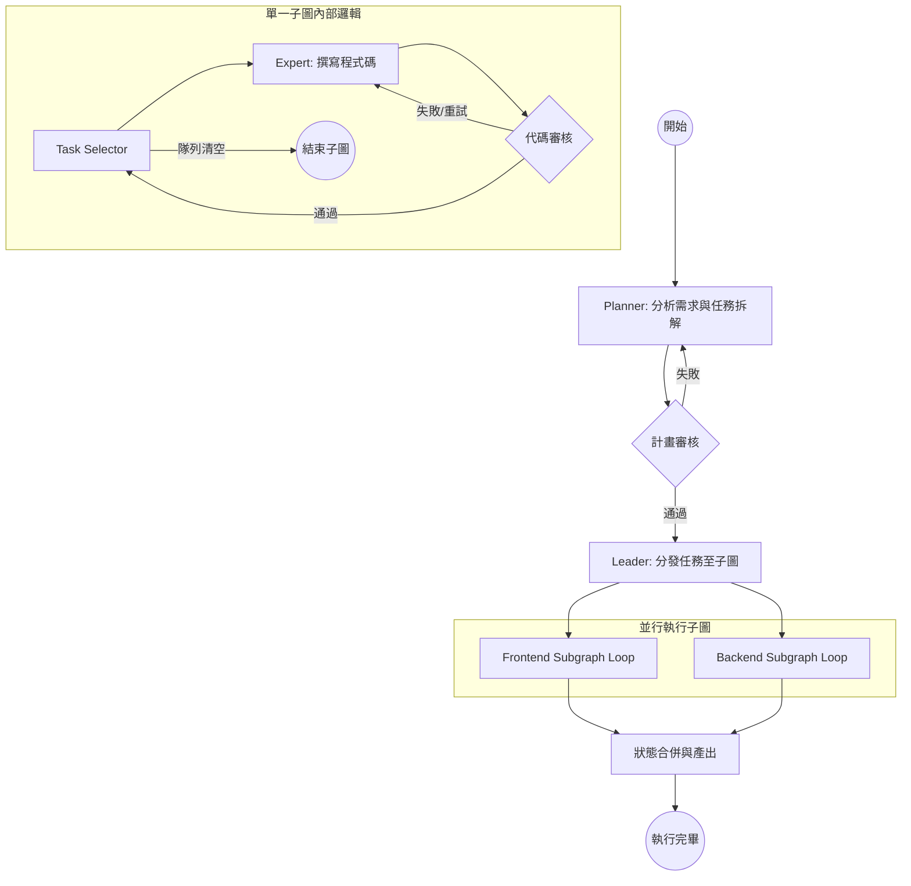

# Multi-Agent Collaboration Development Team (MAC-DT)

[](https://www.python.org/downloads/)
[](https://github.com/langchain-ai/langgraph)

這是一個基於 **LangGraph** 構建的高階多代理人協作系統，模仿了軟體開發團隊的真實工作流程。它能夠將複雜的軟體需求（URD）自動拆解、規劃，並由獨立的**前端與後端專家小組**在併行的子圖中非同步執行與審核。

---

## ✨ 核心特色

-   **🚀 低延遲子圖架構 (Subgraph PULL-based model)**：
    解決了傳統 LangGraph `Send` API 的同步屏障問題。前端與後端專家在各自的獨立子圖內部進行非同步循環（Looping），不會因為其中一方速度較慢而互相阻塞。
-   **📈 等冪狀態合併 (Idempotent State Merging)**：
    實作了自定義的 Reducers (`_merge_task_list`, `_merge_dicts`)，確保來自不同並行分支的任務進度與程式碼變更，能準確且無衝突地合併回主圖狀態。
-   **🛡️ 雙重品質門檻 (Double Quality Gates)**：
    -   **Phase 1 (Planning Review)**: 嚴格審查 Planner 產出的架構設計與任務清單。
    -   **Phase 2 (Task Review)**: 專家完成程式碼後，必須通過 Reviewer 的逐項代碼審核，不通過則觸發自動修復循環。
-   **🛑 智慧斷路器 (Circuit Breakers)**：
    針對所有代理人節點內建了 `MAX_RETRIES` 機制，有效避免 LLM 出現死循環或非受控的重複嘗試。
-   **📉 Token 消耗優化**：
    實作了域名檔案過濾（Domain-specific filtering），Reviewer 審核時只會看到該域名相關的 Context，顯著降低 Token 消耗並提升反應速度。
-   **⚙️ 高度可自訂與擴充 (Dynamic Nodes)**：
    支援透過環境變數直接切換節點或跳過特定階段（如 `SKIP_PLANNER`, `SKIP_PLAN_REVIEWER`）。並能夠以 `ENABLED_EXPERTS` 決定啟用的專家節點範圍（如前端、後端、資料庫等），提供極高的流程可調整性。使用者亦能直接傳入 `.json` 任務清單跳過 AI 規劃。
-   **💾 實時進度保存與復原 (Persistence & Resume)**：
    執行過程中會自動將 Task 狀態與系統設計藍圖匯出至 `tasks_status.json` 與 `checkpoint.json`。若執行中斷，可透過 `--resume` 參數無縫接軌，自動修復並重啟失敗或執行中的任務。
-   **📁 實體工作區感知 (Workspace-Aware)**：
    Expert 與 Reviewer 直接掃描實體工作目錄，解決了透過 Bash 產生的檔案無法被 Agent 感知的「腦裂」問題。內建智慧過濾器自動跳過 `node_modules`、二進位檔與編譯產物，僅審核核心代碼。

---

## 🏗️ 工作流程

系統採用 **「規劃-分發-執行」** 的三階段模型：



---

## 📂 專案結構

```text
├── agent_team/
│   ├── agents/          # 代理人節點 (Planner, Leader, Expert, Reviewer)
│   ├── graph/           # 圖結構定義與建構子 (Builder, Config)
│   ├── schemas/         # 狀態定義 (GraphState, DomainState) 與 Pydantic 模型
│   └── tools/           # 專家可使用的工具 (File I/O, Bash shell)
├── tests/               # 完整的 Graph 測試、電路斷路測試與模式驗證
├── main.py              # CLI 入口
├── .env.example         # 環境變數範例 (需填寫模型與 API Key)
└── pyproject.toml       # 專案依賴管理
```

---

## 🛠️ 快速開始

### 1. 安裝環境
確保您的環境為 Python 3.10 以上版本：

```bash
pip install -r requirements.txt
# 或者使用您的套件管理工具
pip install .
```

### 2. 設定環境變數
複製 `.env.example` 並更名為 `.env`，填入您的 API Key 以及進階設定：

```env
OPENAI_API_KEY=your_key_here
MODEL_NAME=gpt-4o
MAX_RETRIES=3

# 進階動態控制 (非必填)
# 是否跳過 Requirement 分析與設計 (直接外部給定 JSON 任務清單)
SKIP_PLANNER=false
# 是否跳過圖例審核
SKIP_PLAN_REVIEWER=false
# 設定參與協作的專家領域模組
ENABLED_EXPERTS=frontend,backend
```

### 3. 執行系統

**一般執行模式：**
直接在終端機啟動並輸入您的需求：

```bash
python main.py --requirement "設計一個使用者登入介面，包含前端 React 組件與後端的 JWT 驗證 API"
```

**自訂任務執行模式 (Bypass Planner)：**
若在環境變數或 CLI 中設定 `SKIP_PLANNER=true`，您可以直接提供一份規範好的任務清單並跳過 AI 架構設計。
```bash
# 確保 JSON 內容與 ENABLED_EXPERTS 預設匹配
SKIP_PLANNER=true python main.py -t example.json
```

**斷點續傳模式 (Resume Mode)：**
若執行中斷或需重新啟動上次未完成的任務，系統會自動讀取 `./workspace` 下的進度：
```bash
python main.py --resume
```

---

## 🧪 驗證與測試

系統內建了強健的測試套件：

```bash
pytest
```

重點測試項目：
-   **`test_graph.py`**: 驗證子圖迴圈終止條件與全流程狀態傳遞。
-   **`test_circuit_breaker.py`**: 模擬 LLM 持續錯誤時，斷路器是否能正常終止執行。
-   **`test_schemas.py`**: 檢查 `_merge_task_list` Reducer 的等冪性與衝突處理。

---

## 🛡️ 安全提示
*   本系統的專家代理人具有 `bash` 工具操作權限。
*   雖然已在 Prompt 層級限制操作範圍，但在執行前請確保在隔離環境（容器化或虛擬機）中運行。
