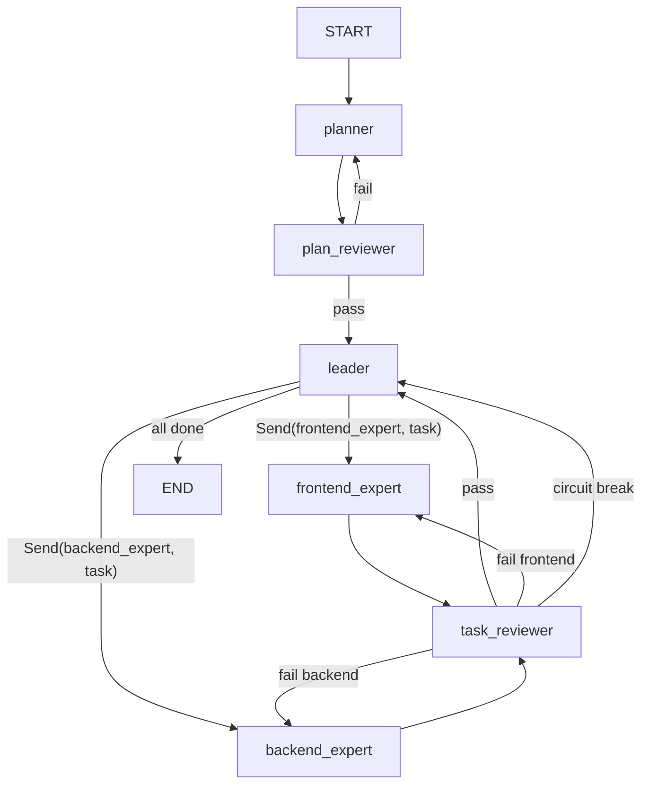

# Multi-Agent Collaboration Development Team

Build a fully automated software development team using **LangGraph** (v1.1.x) and **LangChain**. The system uses a Supervisor–Worker architecture with 5 agent roles: Planner, Leader, Frontend Expert, Backend Expert, and Reviewer.

**Decisions from user review:**
- **LLM**: `ChatOpenAI` — user will fill in `base_url` / `api_key` later. No live LLM tests during development → need **mock-based verification**.
- **Sandbox**: Skip Docker isolation for now; use basic subprocess.
- **Phase 2**: Must be **truly asynchronous & parallel** — Leader dispatches to *both* frontend and backend experts simultaneously via LangGraph `Send` API; experts do NOT wait for each other.

---

## Proposed Changes

### Project Scaffold

#### [NEW] [pyproject.toml](file:///d:/gemini/antigravity/agent_team/pyproject.toml)

Dependencies: `langgraph>=1.1.0`, `langchain>=0.3.0`, `langchain-openai>=0.3.0`, `pydantic>=2.0`, `python-dotenv`, `pytest` (dev).

#### [NEW] [.env.example](file:///d:/gemini/antigravity/agent_team/.env.example)

`OPENAI_API_KEY`, `OPENAI_BASE_URL`, `MODEL_NAME=gpt-4o`, `MAX_RETRIES=10`.

---

### Core State & Schema — `agent_team/schemas/`

#### [NEW] [state.py](file:///d:/gemini/antigravity/agent_team/agent_team/schemas/state.py)

```python
class GraphState(TypedDict):
    original_requirement: str
    system_design: dict
    task_list: list[dict]            # [{id, description, domain, status}, ...]
    current_active_tasks: dict       # {"frontend": "task_2", "backend": "task_1"}
    code_base: dict                  # {filepath: content}
    retry_counters: dict             # {"task_1": 3}
    current_actor: str               # routing indicator
    review_feedback: str             # latest reviewer feedback
    phase: str                       # "planning" | "execution"
    expert_submissions: Annotated[list[dict], operator.add]  # reducer for parallel merge
```

#### [NEW] [models.py](file:///d:/gemini/antigravity/agent_team/agent_team/schemas/models.py)

Pydantic structured output models:
- `TaskItem` — `id`, `description`, `domain`, `status`
- `PlannerOutput` — `system_architecture: dict`, `frontend_tasks: list[TaskItem]`, `backend_tasks: list[TaskItem]`
- `LeaderDecision` — `dispatched_tasks: list[dict]` (supports dispatching to multiple domains at once)
- `ExpertSubmission` — `task_id`, `modified_files: dict`, `tool_execution_summary: str`
- `ReviewerEvaluation` — `is_passed: bool`, `feedback: str`, `task_id: str`

---

### Tools — `agent_team/tools/`

#### [NEW] [file_tools.py](file:///d:/gemini/antigravity/agent_team/agent_team/tools/file_tools.py)

`@tool` functions: `read_file(path)`, `write_file(path, content)`.

#### [NEW] [bash_tool.py](file:///d:/gemini/antigravity/agent_team/agent_team/tools/bash_tool.py)

`bash(command)` — subprocess with 30s timeout, restricted working directory.

---

### Agent Nodes — `agent_team/agents/`

#### [NEW] [planner.py](file:///d:/gemini/antigravity/agent_team/agent_team/agents/planner.py)

Phase 1. Uses `ChatOpenAI.with_structured_output(PlannerOutput)` to produce architecture + fine-grained task lists. Sets `phase="planning"`, `current_actor="reviewer"`.

#### [NEW] [leader.py](file:///d:/gemini/antigravity/agent_team/agent_team/agents/leader.py)

Phase 2 orchestrator. Scans `task_list` for next `pending` tasks in **each** domain. Returns a list of `Send()` objects to fan-out to **both** frontend and backend experts **in parallel**. If all tasks `completed`/`failed`, routes to `END`.

#### [NEW] [experts.py](file:///d:/gemini/antigravity/agent_team/agent_team/agents/experts.py)

`frontend_expert_node` / `backend_expert_node` — ReAct agent with tools (`read_file`, `write_file`, `bash`). Each processes one sub-task, returns `ExpertSubmission`, routes to reviewer.

#### [NEW] [reviewer.py](file:///d:/gemini/antigravity/agent_team/agent_team/agents/reviewer.py)

Quality gate for both phases. On pass → `leader`. On fail → back to originating expert. Circuit breaker at `MAX_RETRIES` → mark `failed`, route to `leader`.

---

### Graph Construction — `agent_team/graph/`

#### [NEW] [builder.py](file:///d:/gemini/antigravity/agent_team/agent_team/graph/builder.py)



**Key: Async Parallel via `Send` API** — The Leader node's conditional edge function returns **multiple `Send()` objects**, causing LangGraph to execute frontend and backend expert nodes **simultaneously in the same super-step**. Expert submissions are merged back into `expert_submissions` via the `operator.add` reducer.

#### [NEW] [config.py](file:///d:/gemini/antigravity/agent_team/agent_team/graph/config.py)

`MAX_RETRIES=10`, `MODEL_NAME`, `TEMPERATURE`, `WORKSPACE_PATH`.

---

### Entry Point

#### [NEW] [main.py](file:///d:/gemini/antigravity/agent_team/main.py)

CLI: loads `.env`, accepts requirement input, builds/compiles graph, invokes, prints results.

---

## Project Structure

```
agent_team/
├── .env.example
├── pyproject.toml
├── main.py
├── agent_team/
│   ├── __init__.py
│   ├── schemas/
│   │   ├── __init__.py
│   │   ├── state.py
│   │   └── models.py
│   ├── tools/
│   │   ├── __init__.py
│   │   ├── file_tools.py
│   │   └── bash_tool.py
│   ├── agents/
│   │   ├── __init__.py
│   │   ├── planner.py
│   │   ├── leader.py
│   │   ├── experts.py
│   │   └── reviewer.py
│   └── graph/
│       ├── __init__.py
│       ├── config.py
│       └── builder.py
└── tests/
    ├── conftest.py          # shared mock LLM fixtures
    ├── test_schemas.py
    ├── test_graph.py
    └── test_circuit_breaker.py
```

---

## Verification Plan (Mock-based, no live LLM)

All tests use **mock LLM responses** (`unittest.mock.patch`) since no API key is available during development.

### Automated Tests

| Test file | What it verifies |
|---|---|
| `test_schemas.py` | Pydantic models accept valid data, reject invalid data |
| `test_graph.py` | Graph compiles; nodes/edges are wired correctly; mock run traces through expected node sequence |
| `test_circuit_breaker.py` | Task reaching `MAX_RETRIES` is marked `failed` and routed to leader, not looping |

Run all: `python -m pytest tests/ -v`

### Structural Verification

- Graph compilation succeeds without LLM
- Mocked Phase 1 flow: `planner → reviewer(pass) → leader`
- Mocked Phase 1 reject: `planner → reviewer(fail) → planner → reviewer(pass) → leader`
- Mocked Phase 2 parallel dispatch: leader sends to both experts simultaneously
- Mocked circuit breaker: reviewer fails task 10 times → task marked `failed`
